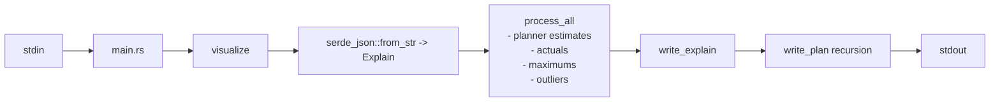
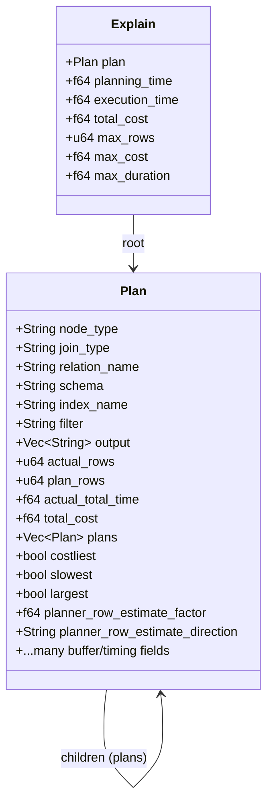
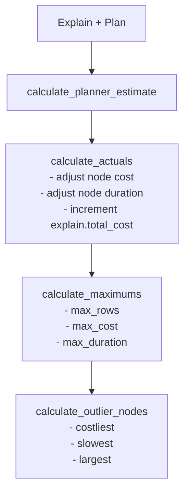
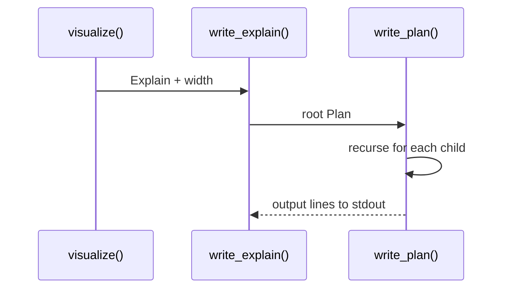

# rustcmdpev Codebase Deep Dive

This document compiles an extensive, multi‑angle understanding of the `rustcmdpev` repository (architecture, developer view, and user view). It is based entirely on the local code and files in this repo.

## At‑A‑Glance Summary

- **What it is**: A Rust CLI that reads PostgreSQL `EXPLAIN (ANALYZE, COSTS, VERBOSE, BUFFERS, FORMAT JSON)` output (JSON), analyzes the plan tree, and renders a colorized ASCII tree summary to stdout.
- **Scope**: A single binary + library crate. The library performs parsing, analysis, and rendering; the binary is a minimal stdin wrapper.
- **Key flow**: `stdin` → JSON parse → analysis (cost/duration/rows, outliers) → render tree → print to stdout.

## Repository Map

- `Cargo.toml` — crate metadata and dependencies.
- `src/main.rs` — CLI entrypoint (stdin → `visualize`).
- `src/lib.rs` — core pipeline: parse, analyze, render.
- `src/display/` — formatting + coloring utilities.
- `src/structure/` — serde models for EXPLAIN JSON (`Explain`, `Plan`).
- `tests/test.rs` — integration tests that assert computed metrics.
- `README.md` — usage notes and examples.
- `sql_test.txt` — quick SQL and piping snippets.
- `todos.md` — refactor and roadmap checklist.

## External Dependencies (Crate Level)

- `serde`, `serde_json` — JSON parsing for EXPLAIN format.
- `phf` — static map for node description strings.
- `colored` — terminal color output.
- `textwrap` — width‑aware line wrapping.

## As a Software Architect

### High‑Level Architecture

The codebase follows a simple pipeline architecture:

1. **Input acquisition**: read full stdin into a string.
2. **Parsing**: `serde_json::from_str` into `Vec<Explain>`.
3. **Analysis**: compute derived metrics for costs, durations, and outliers.
4. **Rendering**: recursively print a tree with colored text and wrapped descriptions.

Mermaid flowchart of the pipeline:



### Component Responsibilities

- **CLI (src/main.rs)**
  - Reads stdin line‑by‑line, joins with `\n`, passes to `rustcmdpev::visualize`.
  - No argument parsing or error handling beyond `expect`.

- **Core Library (src/lib.rs)**
  - Houses calculation logic (`calculate_*`), tree traversal, and rendering.
  - `visualize` is the primary public entrypoint; it returns the computed `Explain`.

- **Display (src/display/...)**
  - Color formatting (`color_format`).
  - Detail string assembly and percent formatting (`format_details`, `format_tags`).
  - Duration text formatting with severity colors.

- **Structure Models (src/structure/...)**
  - `Explain` (top‑level) and `Plan` (node) are `serde` models.
  - `#[serde(default)]` makes the parser tolerant of missing fields.

### Data Model and Tree Structure

The data model mirrors PostgreSQL's JSON plan format. `Explain` contains a root `Plan`, which recursively contains `Vec<Plan>` children.



### Analysis Phases and Derived Metrics

The analysis pipeline is deterministic and happens in `process_all`:

1. **Planner estimate factor**: compares `actual_rows` vs `plan_rows` to compute over/under estimation (`calculate_planner_estimate`).
2. **Actuals and total aggregation**: rolls up duration and cost, excluding child costs unless node is `CTE Scan` (`calculate_actuals`).
3. **Maxima**: tracks max rows, cost, duration for highlighting (`calculate_maximums`).
4. **Outliers**: flags `costliest`, `slowest`, and `largest` nodes (`calculate_outlier_nodes`).



### Rendering Strategy

Rendering is performed directly to stdout in a recursive preorder traversal. It uses a combination of ASCII tree lines and a short description per node. Output includes:

- Node type + details + tags
- Wrapped description (from static map)
- Duration, cost, rows with percent of total
- Optional join, relation, index, filter, hash conditions
- Output columns (wrapped)



### Architectural Notes and Tradeoffs

- **Single module for analysis + rendering**: `src/lib.rs` co‑locates calculation logic and printing. This keeps things compact but mixes concerns.
- **Eager parsing**: stdin is fully buffered into memory and parsed as a single string. This is simpler but not ideal for very large plans.
- **Static descriptions**: a fixed `phf` map provides node descriptions. Missing node types default to empty string.
- **Color output is unconditional**: there is no `NO_COLOR` or TTY detection.

### Risks and Limitations (Architect View)

- **Error handling**: `serde_json::from_str(...).unwrap()` and `stdin` read `expect()` hard‑fail on invalid input.
- **Potential correctness edge cases**: `calculate_actuals` subtracts child costs/durations; may behave unexpectedly for multi‑level or non‑CTE nodes that already include child cost.
- **The `Plan` model is large and flat**: mixed concerns (timing, buffers, identifiers, analysis flags) in one struct.
- **Output width**: hard‑coded width `60` in `main.rs`.

## As a Software Developer

### Build and Run

- Build:
  - `cargo build`
- Run with explicit JSON input:
  - `cargo run -- '[{"Plan":{"Node Type":"Seq Scan","Plan Rows":50,"Plan Width":1572,"Relation Name":"coaches","Startup Cost":0.0,"Total Cost":10.5}}]'`
- Pipe from psql (example from README):
  - `pbpaste | sed '1s/^/EXPLAIN (ANALYZE, COSTS, VERBOSE, BUFFERS, FORMAT JSON) /' | psql -qXAt <DB> | rustcmdpev`

### Tests

- `cargo test -- --nocapture`
- Tests validate:
  - `Explain` aggregation values: total cost, max cost, max rows, max duration.
  - Resilience to missing `Node Type` via `#[serde(default)]`.

### Key Functions and Where to Look

- `visualize` in `src/lib.rs` — end‑to‑end processing entrypoint.
- `process_all` in `src/lib.rs` — orchestrates analysis steps.
- `write_plan` in `src/lib.rs` — recursive rendering and formatting.
- Formatting helpers:
  - `src/display/format.rs`
  - `src/display/colors.rs`
- Data models:
  - `src/structure/data/explain.rs`
  - `src/structure/data/plan.rs`

### Typical Control Flow for a Plan

```mermaid
flowchart LR
    A[JSON input] --> B[Explain + Plan]
    B --> C[process_all]
    C --> D[write_explain]
    D --> E[write_plan (root)]
    E --> F[write_plan (children)]
```

### Extension Points (Developer Perspective)

- **CLI**: add arguments in `src/main.rs` (file input, width, color on/off).
- **Rendering**: add new output formats by factoring `write_plan` into a render module.
- **Analysis**: add new metrics (e.g., buffer stats) in `calculate_*` functions.
- **Model**: extend `Plan` fields as PostgreSQL adds new JSON keys.

### Code Quality Observations

- **Cloning**: many functions pass owned `Plan`/`Explain` and clone frequently. This simplifies ownership but increases allocation and CPU overhead.
- **`fmt::Display` implementation**: `Plan`'s `Display` implementation is effectively recursive on itself and may be incorrect as written (it calls `write!(f, "{}", self)` with `self` again). It's currently unused.
- **Magic constants**: widths, thresholds, and tag labels are hard‑coded.

### Testing Gaps

- No golden output tests for the rendered tree.
- No CLI argument tests (there are no arguments yet).
- No tests for unusual plan node combinations or very deep trees.

## As a User

### What You Provide

- PostgreSQL JSON EXPLAIN output. The tool expects a JSON array (typical of `EXPLAIN (FORMAT JSON)` output).
- Common usage: pipe your EXPLAIN output into `rustcmdpev`.

### What You Get

- A colorized, tree‑like view of the plan.
- Highlighted outliers: `slowest`, `costliest`, `largest`.
- Per‑node rows/cost/duration with percentage of total execution time/cost.

### Typical Workflow

1. Run `EXPLAIN (ANALYZE, COSTS, VERBOSE, BUFFERS, FORMAT JSON) <query>` in PostgreSQL.
2. Pipe output to `rustcmdpev`.
3. Read the printed tree to spot hot nodes and bad estimates.

### Expectations and Constraints

- **Input must be valid JSON**. Invalid input will cause a panic due to `unwrap()`.
- **Color output is always on**, which may not be ideal for non‑TTY output.
- **Fixed width** is set to `60` columns in `src/main.rs`.

## Feature Parity with `gocmdpev`

This repository is described as a Rust port of `gocmdpev` with an intent to reach feature parity. Within this codebase:

- The core capability (parse EXPLAIN JSON, compute metrics, and render a tree) is present.
- There is no explicit compatibility layer or version detection for different Postgres JSON shapes.
- A precise parity comparison to the upstream Go tool requires validating behavior against that repository.

### Parity Checklist (Derived from `gocmdpev` README)

The checklist below focuses on user‑visible capabilities and distribution paths explicitly documented in the upstream README. It highlights where `rustcmdpev` currently matches or differs.

- [x] Accepts PostgreSQL `EXPLAIN (ANALYZE, COSTS, VERBOSE, BUFFERS, FORMAT JSON)` via stdin and renders a tree.
- [x] Provides a macOS `pbpaste | sed ... | psql ... | <tool>` one‑liner workflow (documented in this repo's README as well).
- [ ] Installation via `go get -u` equivalent for Rust (e.g., `cargo install`) is not documented.
- [ ] Homebrew installation path (via tap + `brew install`) is not documented for Rust.
- [ ] Python 3 bindings build path (`make python3`) is not present in this Rust port.
- [ ] Ruby on Rails integration guidance (via the `pg-eyeballs` gem) is not present in this Rust port.
- [ ] Bundled `example.json` sample file (present in the Go repo) is not present in this repo (only ad‑hoc examples in README/tests).

## Known TODOs (from `todos.md`)

The repository includes a large roadmap with improvements in:

- CLI ergonomics (`clap` options, input file support).
- Modularization of analysis vs rendering.
- CI modernization and release automation.
- Improved testing and snapshot tests.

## Practical Notes for Maintenance

- **Refactor candidates**:
  - Split `src/lib.rs` into `analysis`, `render`, and `pipeline` modules.
  - Introduce an error type and return `Result` from `visualize`.
  - Add a CLI layer (e.g., `clap`) to control width and color.

- **Potential bug hotspots**:
  - `calculate_actuals` subtracts child costs/durations. This is correct only if parent totals include child totals in the input.
  - `duration_to_string` appears to use `value / 2000.0` for seconds rather than `1000.0`, which may be an intentional quirk or a bug.

## Suggested Future Diagrams

If you extend the codebase, these diagrams can be elaborated:

- Detailed state diagram for plan node lifecycle (parse → analyze → render).
- Component diagram showing CLI, core library, rendering strategies, and data model isolation.
- Data flow diagram for future multi‑format renderers.

## Appendix: Files Referenced in This Document

- `README.md`
- `Cargo.toml`
- `src/main.rs`
- `src/lib.rs`
- `src/display/colors.rs`
- `src/display/format.rs`
- `src/structure/data/explain.rs`
- `src/structure/data/plan.rs`
- `tests/test.rs`
- `todos.md`
- `sql_test.txt`
