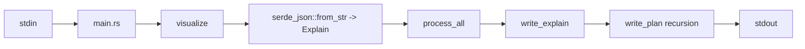
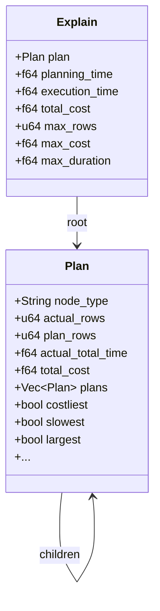

# Overview

This is a compact view of the architecture and runtime flow. For the full multi-angle analysis, see `CODEBASE_OVERVIEW.md` in the repo root.

Core pipeline:

Key modules:

- `src/main.rs` reads stdin and delegates to the library.
- `src/lib.rs` holds parse, analysis, and render logic.
- `src/display/*` handles formatting and colors.
- `src/structure/*` defines the serde models for EXPLAIN JSON.

Data model (simplified):

